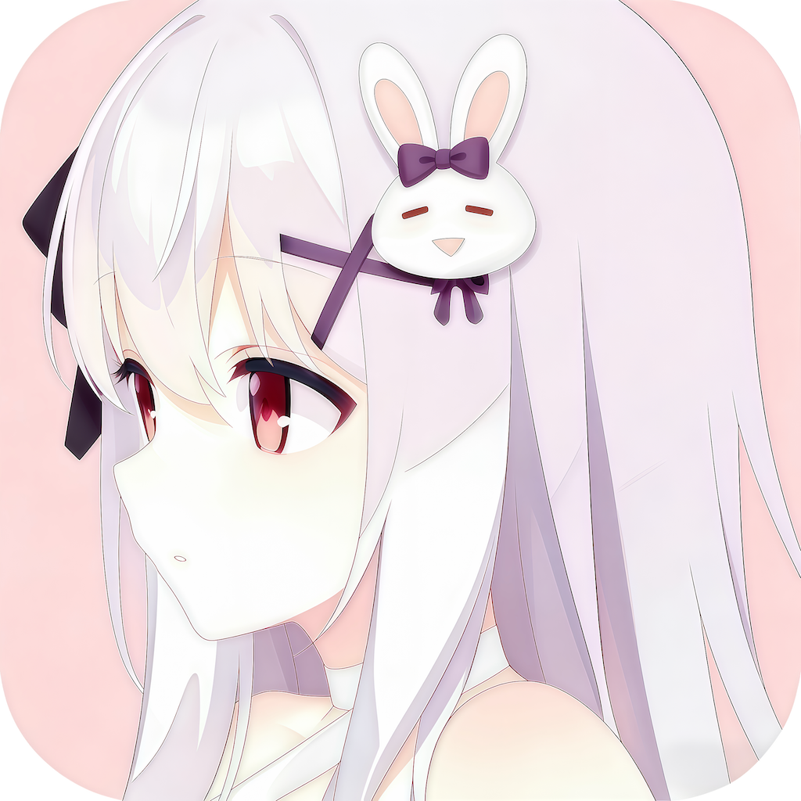

简体中文 | [English](README_en.md)

<div align="center">
  
  <h1>Video Subtitle Remover Web & API</h1>
  <p>视频硬字幕与水印去除工作台，提供 Web 界面和异步 HTTP API。</p>
</div>

<div align="center">


</div>

## 项目定位

这是 [YaoFANGUK/video-subtitle-remover](https://github.com/YaoFANGUK/video-subtitle-remover) 的 Web/API 版本。原项目的 STTN、LAMA、ProPainter、OpenCV 和 OCR 能力被封装为浏览器工作台及异步任务接口，适合部署到局域网 GPU 服务器供多人或其他系统调用。

当前主入口是 `web_app.py`。原有 GUI 和 CLI 仍保留用于兼容，但不再是本仓库的主要使用方式。

请只处理自己拥有或已获授权的视频内容，并遵守适用的版权及平台规则。

## 主要能力

- 浏览器上传视频、选择算法、查看上传进度、处理日志和下载结果
- 异步 REST API：创建任务后通过任务 ID 查询状态，不需要保持长连接
- 单工作进程串行调度，避免多个模型任务同时争抢 GPU 和显存
- 支持暂停及恢复排队任务和运行任务
- 可选 API Key 鉴权、CORS、上传大小和队列容量配置
- 每个处理任务运行在独立子进程中，模型加载失败不会带崩 Web 服务
- 支持固定水印区域，以及 OCR 驱动的间歇字幕/动态文字处理
- 自动生成 OpenAPI、Swagger UI 和 ReDoc 文档

```text
Web 浏览器 / API 客户端
          |
          v
 FastAPI + 内存任务队列
          |
          v
   单个处理子进程
          |
          v
STTN / LAMA / ProPainter / OpenCV
```

## 快速开始

### 1. 准备环境

需要 Python 3.11 或 3.12。先创建并激活虚拟环境：

```bash
python3 -m venv .venv
source .venv/bin/activate
python -m pip install --upgrade pip
```

PyTorch 不在 `requirements-web.txt` 中固定版本，请按设备安装合适版本：

```bash
# CPU 或 macOS
pip install torch torchvision

# NVIDIA GPU 请从 PyTorch 官方安装与驱动/CUDA 匹配的版本
# https://pytorch.org/get-started/locally/
```

然后安装 Web 服务及核心算法依赖：

```bash
pip install -r requirements-web.txt
```

`requirements-web.txt` 默认安装 CPU 版 PaddlePaddle。需要让 Paddle OCR 使用 NVIDIA GPU 时，请根据服务器的 CUDA 版本，将 `paddlepaddle` 替换为官方对应的 `paddlepaddle-gpu` 包。视频修复模型是否使用 GPU 主要由 PyTorch 和运行时硬件检测决定。

### 2. 配置并启动

```bash
cp .env.example .env
./run_web.sh
```

默认地址：

- Web 工作台：`http://127.0.0.1:8000/`
- Swagger UI：`http://127.0.0.1:8000/docs`
- ReDoc：`http://127.0.0.1:8000/redoc`
- 健康检查：`http://127.0.0.1:8000/api/health`

`WEB_HOST=0.0.0.0` 时，同一局域网设备可通过 `http://<服务器IP>:8000/` 访问。对公网开放前必须配置 API Key、反向代理和访问控制。

## Web 使用流程

1. 选择或拖入视频文件。
2. 选择处理模式；固定水印模式需要填写区域坐标。
3. 点击“开始处理”，页面会分别显示上传进度和处理状态。
4. 可在最近任务中切换查看任务，完成后下载结果。

区域格式为 JSON 数组，坐标顺序是 `[ymin, ymax, xmin, xmax]`：

```json
[[620, 700, 80, 1160]]
```

多个固定区域：

```json
[[30, 120, 40, 260], [620, 700, 80, 1160]]
```

## 模式选择

| 模式 | 适用场景 | 是否需要区域 | 说明 |
| --- | --- | --- | --- |
| `sttn-auto` | 连续字幕、动态背景 | 可选 | 默认方案，使用时序信息修复画面 |
| `sttn-det` | 间歇出现的字幕或动态文字水印 | 可选 | 结合 OCR 判断需要处理的帧 |
| `lama` | 动画、静态背景、逐帧修复 | 可选 | 空间修复，时间一致性弱于时序模型 |
| `propainter` | 运动明显、质量优先 | 可选 | 时序质量较高，速度慢且显存占用大 |
| `opencv` | 简单背景、快速预览 | 可选 | 传统算法，速度快但复杂背景效果有限 |
| `logo-lama` | 全程固定位置的 Logo/水印 | 必填 | 不做 OCR，始终修复给定区域 |

固定水印优先使用 `logo-lama` 并准确标记区域。随机出现或位置变化的文字水印可先尝试 `sttn-det`，留空区域让 OCR 全屏检测，或给出一个较大的活动范围以减少误伤。当前版本没有通用的非文字 Logo 自动跟踪器，因此随机移动的图形水印仍可能需要额外的检测/跟踪和逐帧蒙版能力。

## API 快速示例

创建任务使用 `multipart/form-data`：

```bash
curl -X POST http://127.0.0.1:8000/api/jobs \
  -H 'X-API-Key: your-api-key' \
  -F 'file=@input.mp4' \
  -F 'mode=logo-lama' \
  -F 'subtitle_area_coords=[[30,120,40,260]]' \
  -F 'pad=6'
```

查询任务：

```bash
curl -H 'X-API-Key: your-api-key' \
  http://127.0.0.1:8000/api/jobs/<job_id>
```

暂停与恢复：

```bash
curl -X POST -H 'X-API-Key: your-api-key' \
  http://127.0.0.1:8000/api/jobs/<job_id>/pause

curl -X POST -H 'X-API-Key: your-api-key' \
  http://127.0.0.1:8000/api/jobs/<job_id>/resume
```

下载结果：

```bash
curl -L -H 'X-API-Key: your-api-key' \
  -o output.mp4 \
  http://127.0.0.1:8000/api/jobs/<job_id>/download
```

未配置 `WEB_API_KEY` 时可以省略鉴权请求头。完整参数、返回结构和状态说明见 [API 文档](docs/API.md)。

## 任务调度说明

- 服务固定使用一个 worker，同一时间只运行一个视频处理任务，其余任务排队。
- 暂停排队任务会阻止它开始执行。
- 暂停正在运行的任务会冻结其子进程，但不会释放已经加载的模型或 GPU 显存。
- 运行任务暂停后不会自动切换到下一个排队任务，因为当前单 worker 仍在等待该任务恢复或结束。
- 任务列表保存在进程内存中，服务重启后不会恢复任务状态。
- 上传文件和输出文件保存在 `VSR_DATA_DIR`，当前版本不会自动清理磁盘文件。

如果需要多 GPU 并行、任务抢占、重启恢复或自动过期清理，应在外层增加持久化队列、独立 worker 和对象存储。

## 配置项

| 环境变量 | 默认值 | 作用 |
| --- | --- | --- |
| `WEB_HOST` | `0.0.0.0` | Web 监听地址 |
| `WEB_PORT` | `8000` | Web 监听端口 |
| `WEB_API_KEY` | 空 | 非空时保护配置及任务接口 |
| `WEB_CORS_ORIGINS` | 空 | 逗号分隔的跨域来源 |
| `VSR_PYTHON` | 当前服务解释器 | 显式指定处理子进程使用的 Python |
| `VSR_DATA_DIR` | `./web_data` | 上传和结果目录 |
| `VSR_FFMPEG_PATH` | 自动检测 | 自定义 FFmpeg 可执行文件路径 |
| `VSR_MAX_UPLOAD_BYTES` | `2147483648` | 单个上传文件上限，默认 2 GiB |
| `VSR_QUEUE_SIZE` | `8` | 等待队列容量 |
| `VSR_MAX_JOBS` | `100` | 内存中保留的最大任务记录数 |

更多服务器安装、systemd、反向代理和 GPU 排查说明见 [部署文档](docs/DEPLOYMENT.md)。

## 兼容入口

原项目入口仍然保留：

```bash
# CLI
python -m backend.main --input input.mp4 --output output.mp4 --inpaint-mode sttn-auto

# 桌面 GUI，需要安装 requirements.txt 中的 Qt 依赖
python gui.py
```

上游桌面版本的详细安装、预构建包和训练说明请查看 [原项目文档](https://github.com/YaoFANGUK/video-subtitle-remover)。

## 项目结构

```text
web_app.py                 FastAPI、任务队列和静态文件入口
web/                       Web 工作台前端
backend/                   OCR、视频修复算法和模型
run_web.sh                 单 worker 启动脚本
requirements-web.txt       不含 Qt 的 Web 依赖
.env.example               服务配置示例
web.service.example        systemd 用户服务示例
docs/API.md                API 参考
docs/DEPLOYMENT.md         部署与运行说明
```

## 上游与许可证

本项目基于 [YaoFANGUK/video-subtitle-remover](https://github.com/YaoFANGUK/video-subtitle-remover) 二次开发，继续使用 [Apache License 2.0](LICENSE)。算法、模型及第三方组件可能有各自的许可证和使用约束，部署或分发前请分别确认。
